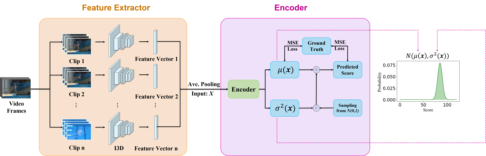

# DAE-AQA
It is an open source program reference to paper **Auto-Encoding Score Distribution Regression for Action Quality Assessment**. 
 
 
## 1.Introduction

DAE is a model for action quality assessment(AQA). It takes both advantages of regression algorithms and label distribution learning (LDL). Specifically, it encodes videos into distributions and uses the reparameterization trick in variational auto-encoders (VAE) to sample scores, which establishes a more accurate mapping between video and score. 
It can be appled to many scenarios. e.g, judgment of accuracy of an operation or score estimation of an diving athlete’s performance.

 <div align=center>
 
</div>
 
## 2.Datasets

#### MTL-AQA dataset
MTL-AQA dataset was orignially presented in the paper __What and How Well You Performed? A Multitask Learning Approach to Action Quality Assessment__ (CVPR 2019) \[[arXiv](https://arxiv.org/abs/1904.04346)\], where the authors provided the YouTube links of untrimmed long videos and the corresponding annotations at [here](https://github.com/ParitoshParmar/MTL-AQA/tree/master/MTL-AQA_dataset_release). The processed MTL-AQA dataset(Frames) can be downloaded through the following links:

1.[[Google Drive](https://drive.google.com/drive/folders/1J_OO6UNJ27WLpjm6nRwqp9WIq0bUeINY?usp=sharing)]

2.[[Baidu Drive](https://pan.baidu.com/s/1-EH7Q0LtaDCicateuT9mFg)](Password:SEU1)

The whole data structure should be:
```
DAE_AQA
├── data
|  └── frames
|  └── info
...
```
#### JIGSAWS dataset
JIGSAWS dataset was presented in the paper __Jhu-isi gesture and skill assessment working set (jigsaws): A surgical activity dataset for human motion modeling__ (MICCAI workshop 2014), where the raw videos could be downloaded at [here](https://cirl.lcsr.jhu.edu/research/hmm/datasets/jigsaws_release/). We're typographing this part of the code, and we'll release it soon. The whole data structure is same as MTL-AQA. The processed JIGSAWS dataset(Frames) can be downloaded through the following links:

1.[[Google Drive](https://drive.google.com/drive/folders/1J_OO6UNJ27WLpjm6nRwqp9WIq0bUeINY?usp=sharing)]

2.[[Baidu Drive](https://pan.baidu.com/s/1-EH7Q0LtaDCicateuT9mFg)](Password:SEU1)

## 3.Training

training DAE model:
~~~shell
$ python DAE.py --log_info=DAE --num_workers=16 --gpu=0 --train_batch_size=8 --test_batch_size=32 --num_epochs=100
~~~

training DAE-MT model:
~~~shell
$ python DAE_MT.py --log_info=DAE-MT --num_workers=16 --gpu=0 --train_batch_size=8 --test_batch_size=32 --num_epochs=100
~~~

All parameters are set in config.py. Considering that the memory of video processing on GPU is quite large, we suggest using small batch for training.qwq

## 4.Testing

We provided a pre-trained DAE-MT model weight with a correlation coefficient of 0.9449 on MTL-AQA test dataset. You can download it through the following links:

1.[[Google Drive](https://drive.google.com/drive/folders/1J_OO6UNJ27WLpjm6nRwqp9WIq0bUeINY?usp=sharing)]

2.[[Baidu Drive](https://pan.baidu.com/s/1-EH7Q0LtaDCicateuT9mFg)](Password:SEU1)

## CONTACT US:
If you have any questiones or meat any bugs, please contact us! 
E-mail: 1814970127@qq.com
