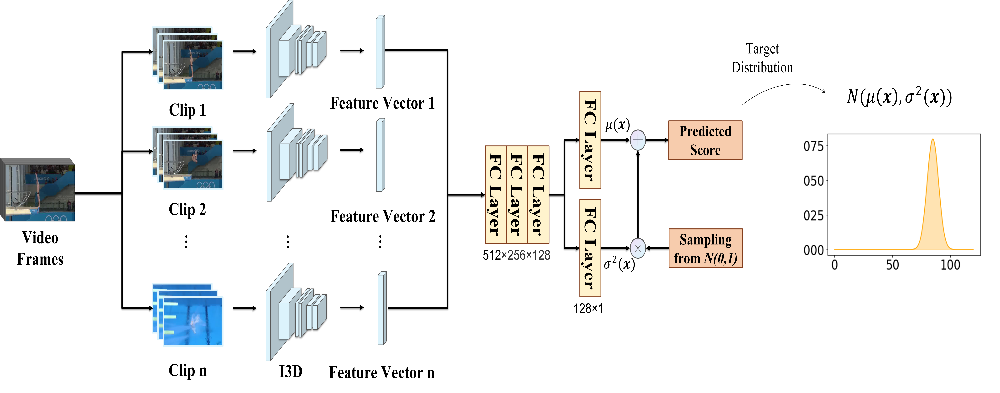

# DAE-AQA
PyTorch implementation of paper **Auto-Encoding Score Distribution Regression for Action Quality Assessment**. 
[[Project Website]](https://github.com/InfoX-SEU/DAE-AQA) [[Paper]](https://arxiv.org/abs/2111.11029) 

 
 
## 1.Introduction

The action quality assessment (AQA) of videos is a challenging vision task since the relation between videos and action scores is difficult to model. Thus, AQA has been widely studied in the literature. Traditionally, AQA is treated as a regression problem to learn the underlying mappings between videos and action scores. But previous methods ignored data uncertainty in AQA dataset. To address aleatoric uncertainty, we further develop a plug-and-play module Distribution Auto-Encoder (DAE). Specifically, it encodes videos into distributions and uses the reparameterization trick in variational auto-encoders (VAE) to sample scores, which establishes a more accurate mapping between videos and scores. Meanwhile, a likelihood loss is used to learn the uncertainty parameters. We plug our DAE approach into MUSDL and CoRe. Experimental results on public datasets demonstrate that our method achieves state-of-the-art on AQA-7, MTL-AQA, and JIGSAWS datasets. 

 <div align=center>
 
</div>
 
## 2.Datasets

#### MTL-AQA dataset
MTL-AQA dataset was orignially presented in the paper __What and How Well You Performed? A Multitask Learning Approach to Action Quality Assessment__ (CVPR 2019) \[[arXiv](https://arxiv.org/abs/1904.04346)\], where the authors provided the YouTube links of untrimmed long videos and the corresponding annotations at [here](https://github.com/ParitoshParmar/MTL-AQA/tree/master/MTL-AQA_dataset_release). The processed MTL-AQA dataset(Frames) can be downloaded through the following links:

1.[[Google Drive](https://drive.google.com/drive/folders/1J_OO6UNJ27WLpjm6nRwqp9WIq0bUeINY?usp=sharing)]

2.[[Baidu Drive](https://pan.baidu.com/s/1-EH7Q0LtaDCicateuT9mFg)](Password:SEU1)

The whole data structure should be:
```
DAE_AQA
├── data
|  └── frames
|  └── info
...
```
#### JIGSAWS dataset
JIGSAWS dataset was presented in the paper __Jhu-isi gesture and skill assessment working set (jigsaws): A surgical activity dataset for human motion modeling__ (MICCAI workshop 2014), where the raw videos could be downloaded at [here](https://cirl.lcsr.jhu.edu/research/hmm/datasets/jigsaws_release/). The whole data structure is same as MTL-AQA. The processed JIGSAWS dataset(Frames) can be downloaded through the following links:

1.[[Google Drive](https://drive.google.com/drive/folders/1J_OO6UNJ27WLpjm6nRwqp9WIq0bUeINY?usp=sharing)]

2.[[Baidu Drive](https://pan.baidu.com/s/1-EH7Q0LtaDCicateuT9mFg)](Password:SEU1)

## 3.Running

training DAE model:
~~~shell
$ python DAE.py --log_info=DAE --num_workers=16 --gpu=0 --train_batch_size=8 --test_batch_size=32 --num_epochs=100
~~~

training DAE-MT model:
~~~shell
$ python DAE_MT.py --log_info=DAE-MT --num_workers=16 --gpu=0 --train_batch_size=8 --test_batch_size=32 --num_epochs=100
~~~

